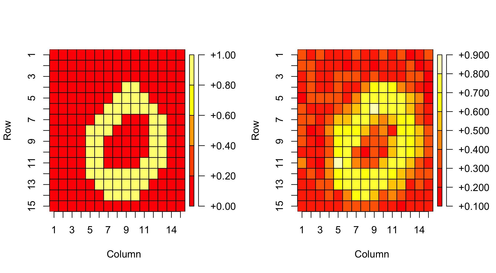

# ExponentialGM
R package for implementing full-likelihood based inference in pariwise exponential family graphical models. The models include fully observed (Ising model, Poisson graphical model) and partially observed (Boltzmann machine and Restricted Boltzmann machine) models. To install the package, use:

```
install.packages("devtools")
install_github("chenyujie1104/ExponentialGM")

```

## Description
Pairwise exponential family graphical models constitute a flexible class of models that allows modeling dependence in multivariate data through simple univariate exponential families. Moreover, when some variables are not observed, the resulting marginal distribution deviates from the exponential family, allowing further flexibility; these latent exponential family models are more popularly known as Boltzmann machines, which are fundamental building blocks of generative AI. However, a key roadblock in likelihood-based inference for these models is the intractable normalizing constant. We develop a Monte Carlo estimate of the normalizing constant, which enables us to perform full-likelihood and Bayes analysis on these models.

## Examples

### Ising model (Fully observed model)
The Ising model is a popular model for multivariate binary data. A typical example of modeling multivariate binary using the package is given below. 

```
library(ExponentialGM)
p = 3
n = 100
theta0 = matrix(-0.8, p, p)
X_3 = IsingSim(n, theta0, 1000)
EGM.fit(X = X_3, model = "ising")

```

### RBM (Partially observed model)

```
# install.packages("devtools")
## Access MNIST data from "RBM" package ##
library(devtools)
install_github("TimoMatzen/RBM")
library(RBM)
data(MNIST)
install.packages("OpenImageR")
library(OpenImageR)
```
The above chunk of code installs the "RBM" package which contains the MNIST data. The data contains images of handwritten digits (0-9). The original data contains images of 784 = 28 by 28 pixels. Each pixel records a number within 0-255. We first preprocess it to images of 15 by 15 pixels, and also conver each pixel to 0 or 1 using the "OpenImageR" package. 

```
zero_data = which(MNIST$trainY == 0)
zeroX = MNIST$trainX[zero_data,]
zero_data_test = which(MNIST$testY == 0)
zeroX_test = MNIST$testX[zero_data_test,]

n = nrow(zeroX)
p = ncol(zeroX)
q = 15
zeroX_low = matrix(0, n, q^2)
for(i in 1:n)
{
  y = resizeImage(matrix(zeroX[i,], sqrt(p), sqrt(p), byrow = T), width = q, height = q, normalize_pixels = T)
  zeroX_low[i,] = as.vector(y)
}
zeroX_low[zeroX_low>0.5] = 1
zeroX_low[zeroX_low<=0.5] = 0


n_t = nrow(zeroX_test)
p = ncol(zeroX_test)

zeroX_test_low = matrix(0, n_t, q^2)
for(i in 1:n_t)
{
  y = resizeImage(matrix(zeroX_test[i,], sqrt(p), sqrt(p), byrow = T), width = q, height = q, normalize_pixels = T)
  zeroX_test_low[i,] = as.vector(y)
}
zeroX_test_low[zeroX_test_low>0.5] = 1
zeroX_test_low[zeroX_test_low<=0.5] = 0


par(mar=c(5.1, 4.1, 4.1, 4.1))
plot(matrix(as.factor(zeroX_low[1,]), q, q), main = "")
plot(matrix(as.factor(zeroX_low[2,]), q, q), main = "")

V = zeroX_low
p = ncol(V)
m = 50
N = 1000
step_size = 0.00001
epsilon = 0.06
theta = matrix(0, p+m, p+m)
convergence_check = 10
iter = 0
max_iter = 1000
k = 1

theta_mle = RBM_fit(V, p, m, N, step_size, epsilon, k, method = "likelihood", max_iter)
```

After fitting the RBM model, we want to reconstruct some test images.
```
V_obs = zeroX_test_low[1,]
V_mle = RBM_reconstruct(V_obs, theta_mle, p, m)
par(mfrow = c(1,2))
plot(matrix(V_obs, q, q), main = "")
plot(matrix(V_mle$v1, q, q), main = "")
```
Below is an example output:



### Count data and RBM training by Contrastive Divergence

To fit the Poisson Graphical model, use model = "pgm" in ExponentialGM(). To train the RBM using constrastive divergence, use method = "CD" in RBM().
